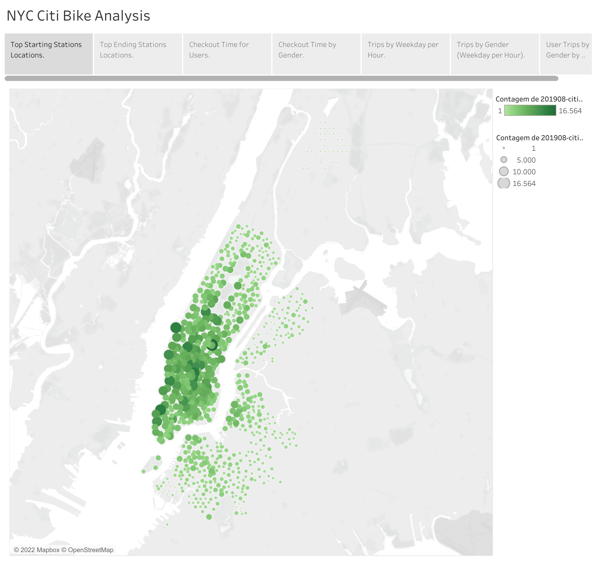
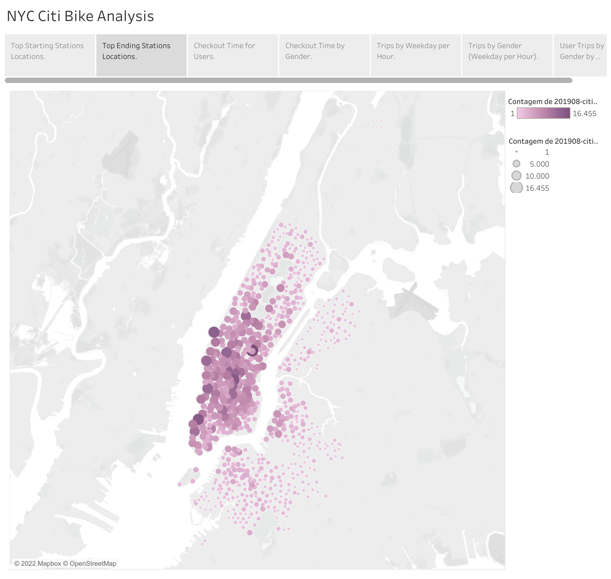
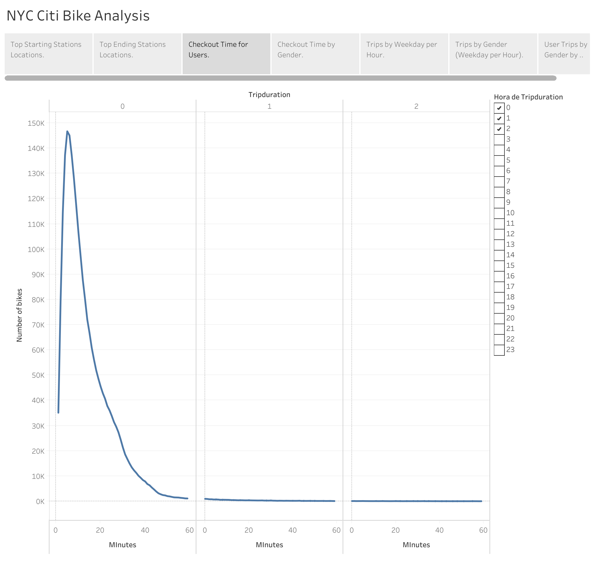
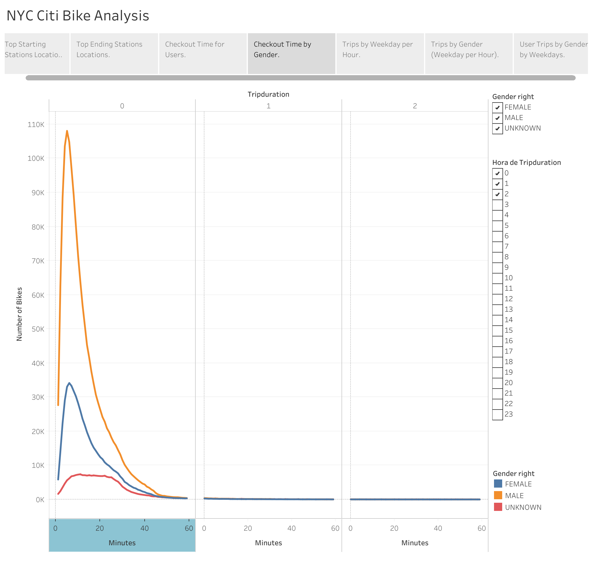
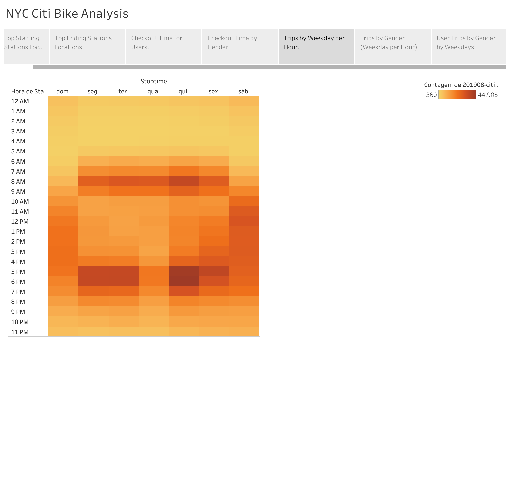
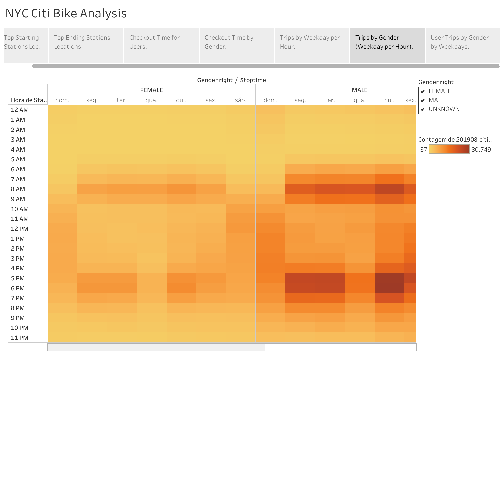
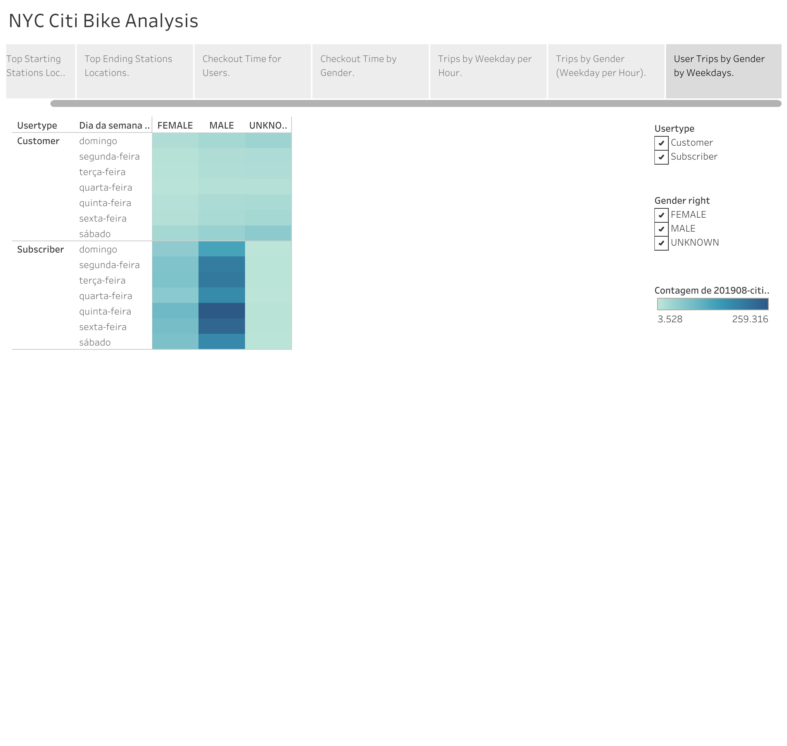

# bikesharing
Work with Tableau to present a business proposal for a bike-sharing company.
## Overview 

The purpose of this project is to present an analysis of the impacts and success of bikesharing in New York City.

The following questions were elaborated on to guide the project's analysis:
- What are the top bike stations in the city for starting a journey?
- What are the top bike stations in the city for ending a journey?
- How long are bikes checked out for all riders and genders?
- How many trips are taken by the hour for each day of the week for all riders and genders?
- A breakdown of what days of the week a user might be more likely to check out a bike by type of user and gender. 

[link to dashboard](https://public.tableau.com/views/NYCCitiBikeAnalysis_16699374940950/NYCCitiBikeAnalysis?:language=pt-BR&publish=yes&:display_count=n&:origin=viz_share_link)

## Resources 
- data: https://ride.citibikenyc.com/system-data (201908-citibike-tripdata.csv.zip)
- source: Pandas, Jupyter Notebook, Tableau.

## Results 
1. Top Starting Stations Locations

.

2. Top Ending Stations Locations

.

3. Checkout Time for Users

.

4. Checkout Time by Gender
.

5. Trips by Weekday per Hour

.

6. Trips by Gender (Weekday per Hour)

.

7.User Trips by Gender by Weekdays
.

## Summary 
